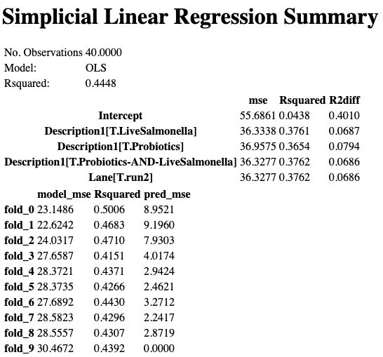
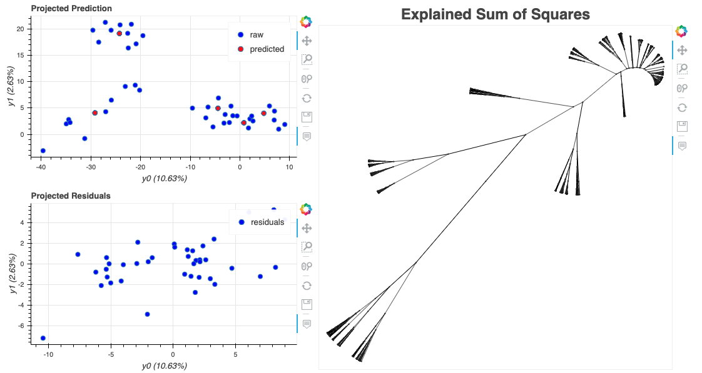

# Exploring 16S data from Oral treatments with probiotics and live Salmonella

* 2019/11/25
* /Users/severin/qiimeTemp/

There appears to be a lane effect and we want to investigate the extent to which the lane effect is confounded with any of the treatment groups.

* See [Notebook_Seetharam/methods-qiime.md](/MelhaMellata/Notebook_Seetharam/methods-qiime.md) for the original analysis


## data files

These files were taken from the analysis performed by Arun Seetharam.
```
ln -s ../Mellata/sample-metadata.tsv
ln -s ../Mellata/qza_files/table-dada2.qza
ln -s ../Mellata/qza_files/taxonomy.qza

```

## Gneiss analysis of frequency table

We can explore how different fixed factors contribute to the abundances in the frequencies.a

### Gneiss Correlation-clustering

This clustering method uses the Ward hierarchical cluster.  If two microbes are highly correlated across all of the samples, then the distance will shrink close to zero

```
qiime gneiss correlation-clustering \
  --i-table table-dada2.qza \
  --o-clustering hierarchy.qza
```

### Building linear models using balances¶

The isometric log ratio (ILR) transform computes the log ratios between groups at each node in the tree.  These balances avoid situations where one very abudundant species can cause a comparison between organisms to appear different.

```
qiime gneiss ilr-hierarchical \
  --i-table table-dada2.qza \
  --i-tree hierarchy.qza \
  --o-balances balances.qza
```


## Building linear models using balances¶

I changed NoTreatment to ANoTreatment to make it alpha numerically the first of the treatment categories so that it uses it to compare the other treatments to.  OLS = Ordinary least squares


```
qiime gneiss ols-regression \
  --p-formula "Description1+Lane" \
  --i-table balances.qza \
  --i-tree hierarchy.qza \
  --m-metadata-file sample-metadata3.tsv \
  --o-visualization regression_summary_lane_3.qzv

  qiime tools view regression_summary_lane_3.qzv
```



We can see from the Regression Summary that the Rsquared value for the different treatment groups can explain ~ 37% of the variation.  Unfortunately, the Lane effect can explain a similar amount.  



The projected prediction (red) fits the model (blue) very well and the residuals aren't bad.


## Heatmap on Lane

The lane effect is very apparent in the heatmap that we can produce using Gneiss.

```
qiime gneiss dendrogram-heatmap \
  --i-table table-dada2.qza \
  --i-tree hierarchy.qza \
  --m-metadata-file sample-metadata3.tsv  \
  --m-metadata-column Lane \
  --p-color-map seismic \
  --o-visualization heatmapLane.qzv

  qiime tools view heatmapLane.qzv
  ```


## Heatmap Treatments

Looking at the previous heatmap and this heatmap it is clear that Lane effect is problematic. It is easy to pick out 3 of the 4 probiotic treatment samples that were in lane 1, as well.

```
qiime gneiss dendrogram-heatmap \
  --i-table table-dada2.qza \
  --i-tree hierarchy.qza \
  --p-ndim 30 \
  --m-metadata-file sample-metadata3.tsv  \
  --m-metadata-column Description1 \
  --p-color-map seismic \
  --o-visualization heatmapTreatment.qzv
  qiime tools view heatmapTreatment.qzv
  ```


## Strategy

There is clearly a strong lane effect and since only samples from the probiotic and notreatments group were included in lane 1, there is no method to correct for lane effect for the treatment groups with live salmonella with lane one.  

There are no more DNA left to rerun the sequencing for these samples.  Therefore the best solution given the constraints is to remove lane 1 and only analyze samples in lane 2, which includes the probiotic, probiotic + live salmonella and salmonella treatements.

[Analysis of lane 2 done here](/Notebook_Severin/01b_qiime.md)
