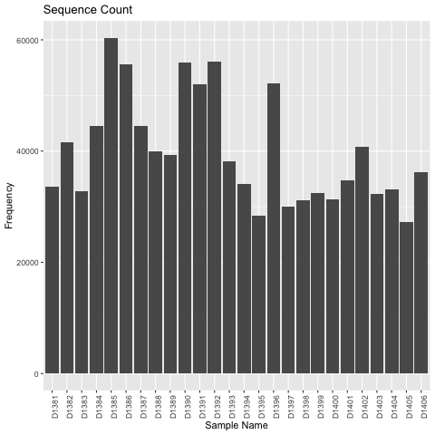

# Qiime processing of data


## Data

* 2019/11/26
* /work/GIF/arnstrm/Mellata/severin/01_qiime

We will only be using lane 2 which is run2 in the data folder.  I just made a copy of the run2 data to work with.

```
cp -r ../../01-data/run2 .
```

Copy over the combined mapping file and remove the run2 data as it is already well formatted.

```
awk '/#/ || $5==5' ~/qiimeTemp/Mellata/sample-metadata.tsv > sample-metadata.tsv
```


Rename files in run2 directory to inputs Qiime will recognize.

```

mv run2_I1.fq.gz barcodes.fastq.gz
mv run2_R1.fq.gz foward.fastq.gz
mv run2_R2.fq.gz reverse.fastq.gz
mv run2/ input
```

```
.
└── input
    ├── barcodes.fastq.gz
    ├── forward.fastq.gz
    ├── reverse.fastq.gz

```


## Qiime2 script

```
source activate .qiime
#qiime2-2019.10

```

Import the data as qiime object

```bash
qiime tools import \
   --type EMPPairedEndSequences \
   --input-path /Users/severin/Desktop/Projects/Mellata/01_qiime/input \
   --output-path sequences.qza
```

Demultiplex the file using the new metadata file created specifically for the samples of interest.

```bash
qiime demux emp-paired \
   --i-seqs sequences.qza \
   --m-barcodes-file sample-metadata.tsv \
   --m-barcodes-column BarcodeSequence \
   --p-rev-comp-barcodes \
   --p-rev-comp-mapping-barcodes \
   --o-per-sample-sequences combined-demux.qza \
   --o-error-correction-details error-correction.qza

qiime demux summarize \
   --i-data combined-demux.qza \
   --o-visualization combined-demux.qzv
```

Generate feature table for the demultiplexed data, generate feature data summaries and visualization files.

```bash
qiime dada2 denoise-paired \
   --i-demultiplexed-seqs combined-demux.qza \
   --p-trunc-len-f 0 \
   --p-trunc-len-r 0 \
   --p-n-threads 16 \
   --o-table table-dada2.qza   \
   --o-representative-sequences rep-seqs-dada2.qza \
   --o-denoising-stats stats-dada2.qza

qiime metadata tabulate \
   --m-input-file stats-dada2.qza \
   --o-visualization stats-dada2.qzv

qiime feature-table summarize \
   --i-table table-dada2.qza \
   --o-visualization table-dada2.qzv \
   --m-sample-metadata-file sample-metadata.tsv

qiime feature-table tabulate-seqs \
   --i-data rep-seqs-dada2.qza \
   --o-visualization rep-seqs-dada2.qzv
 ```

 Generate a tree for phylogenetic diversity analyses

```bash
a
```

Taxonomical analysis using GreenGenes database (13.8). After checking the amplicon length for the rep-seqs, it was noted that the primer pair 515F/806R was used for this study, so the pre-made database specific for this region was downloaded from qiime webpage.

```bash

#searched greengenes 21.2
wget https://data.qiime2.org/2019.7/common/gg-13-8-99-515-806-nb-classifier.qza

qiime feature-classifier classify-sklearn \
   --i-classifier gg-13-8-99-515-806-nb-classifier.qza \
   --i-reads rep-seqs-dada2.qza \
   --o-classification taxonomy.qza

qiime taxa barplot \
   --i-table table-dada2.qza \
   --i-taxonomy taxonomy.qza \
   --m-metadata-file sample-metadata.tsv \
   --o-visualization taxa-bar-plots.qzv
```


Alpha and beta diversity analysis. For sampling depth (rarefaction), the lowest number of reads that retains all 40 samples was used.

* need to make the samples.png plot

```
library(qiime2R)
library(phyloseq)
library(tidyverse)

statsdada2<-read_qza("stats-dada2.qza")
p <- ggplot(as.data.frame(statsdada2$data), aes(x=rownames(statsdada2$data),y=statsdada2$data[,7])) +geom_bar(stat = "identity")+ ggtitle("Sequence Count") + xlab("Sample Name") + ylab("Frequency")
p + theme(axis.text.x = element_text(angle = 90))

png("samplecounts.png")
p + theme(axis.text.x = element_text(angle = 90))
dev.off()

min(statsdada2$data[,7])
[1] 27272
```




```bash
qiime diversity core-metrics-phylogenetic \
   --i-phylogeny rooted-tree.qza \
   --i-table table-dada2.qza \
   --p-sampling-depth 27272 \
   --m-metadata-file sample-metadata.tsv \
   --output-dir core-metrics-results

qiime diversity alpha-group-significance \
   --i-alpha-diversity core-metrics-results/faith_pd_vector.qza \
   --m-metadata-file sample-metadata.tsv \
   --o-visualization core-metrics-results/faith-pd-group-significance.qzv

qiime diversity alpha-group-significance \
   --i-alpha-diversity core-metrics-results/evenness_vector.qza \
   --m-metadata-file sample-metadata.tsv \
   --o-visualization core-metrics-results/evenness-group-significance.qzv

qiime emperor plot  \
   --i-pcoa core-metrics-results/unweighted_unifrac_pcoa_results.qza  \
   --m-metadata-file sample-metadata.tsv \
   --p-custom-axes AnimalID   \
   --o-visualization core-metrics-results/unweighted-unifrac-emperor-treatment.qzv

qiime tools view unweighted-unifrac-emperor-treatment.qzv
```

We can see that there is good separation between the treatement groups.


However, there is also a large unknown factor in this data that could be differences in sex. It doesn't affect the main axes that separate out treatment but will be accounted for in the model.


Rarefaction Plots

```bash
qiime diversity alpha-rarefaction \
   --i-table table-dada2.qza \
   --i-phylogeny rooted-tree.qza \
   --p-max-depth 10000 \
   --m-metadata-file sample-metadata.tsv \
   --o-visualization alpha-rarefaction.qzv
```
