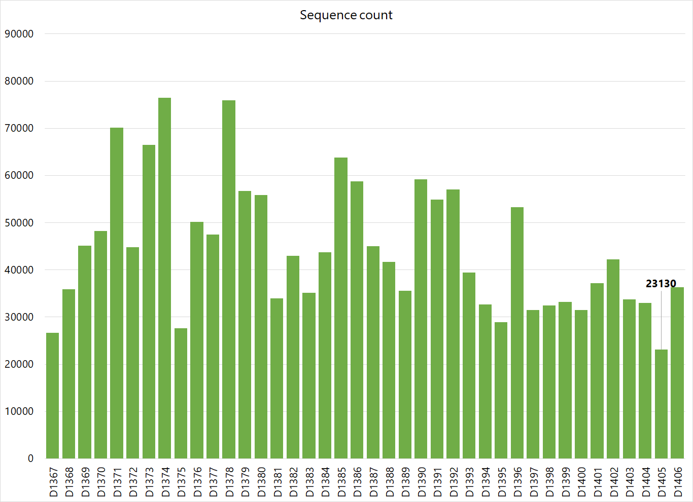

## Methods

### Data

The methods will assume that you've transferred the data from the CyBox to Condo cluster. We obtained the direct links for the files and downloaded them using `wget` command. There were 2 runs for this project and both runs were kept in separate folders, with their metadata. The files were renamed to easily identify. Following was the file structure.

```
01_data
├── run1
│   ├── run1_I1.fq.gz
│   ├── run1_mapping.txt
│   ├── run1_R1.fq.gz
│   └── run1_R2.fq.gz
└── run2
    ├── run2_I1.fq.gz
    ├── run2_mapping.txt
    ├── run2_R1.fq.gz
    └── run2_R2.fq.gz
```

Next, we combined the R1, R2 and I1 files from both runs as `forward.fastq.gz`, `reverse.fastq.gz` and `barcodes.fastq.gz` as qiime2 will recognize these files and process them. They were kept in a new folder names `input`

```bash
mkdir -p input
cat run1/run1_R1.fq.gz run2/run2_R1.fq.gz >> input/forward.fastq.gz
cat run1/run1_R2.fq.gz run2/run2_R2.fq.gz >> input/reverse.fastq.gz
cat run1/run1_I1.fq.gz run2/run2_I1.fq.gz >> input/barcodes.fastq.gz
```
In the next step, we combined both mapping files. Once combined, we had to manually edit them to remove the header line as well as adjust the fields so that both files match up on columns (run2 mapping file had some blank columns). Then the file was trimmed to retain only the samples needed for this experiment. The final `sample-metadata.tsv` file can be found [here](sample-metadata.tsv)

Now the data is ready to be processed.


### Qiime2 pipeline

Request the desired compute node and load the qiime module:

```bash
salloc -N 1 -n 16 -t 8:00:00
module load GIF/qiime2
source activate qiime2-2018.11
```

Import the data as qiime object

```bash
qiime tools import \
   --type EMPPairedEndSequences \
   --input-path /work/GIF/arnstrm/Mellata/01-data/input \
   --output-path sequences.qza
```

Demultiplex the file using the new metadata file created specifically for the samples of interest.

```bash
qiime demux emp-paired \
   --i-seqs sequences.qza \
   --m-barcodes-file sample-metadata.tsv \
   --m-barcodes-column BarcodeSequence \
   --p-rev-comp-barcodes \
   --p-rev-comp-mapping-barcodes \
   --o-per-sample-sequences combined-demux.qza

qiime demux summarize \
   --i-data combined-demux.qza \
   --o-visualization combined-demux.qzv
```

Generate feature table for the demultiplexed data, generate feature data summaries and visualization files.

```bash
qiime dada2 denoise-paired \
   --i-demultiplexed-seqs combined-demux.qza \
   --p-trunc-len-f 0 \
   --p-trunc-len-r 0 \
   --p-n-threads 16 \
   --o-table table-dada2.qza   \
   --o-representative-sequences rep-seqs-dada2.qza \
   --o-denoising-stats stats-dada2.qza

qiime metadata tabulate \
   --m-input-file stats-dada2.qza \
   --o-visualization stats-dada2.qzv

qiime feature-table summarize \
   --i-table table-dada2.qza \
   --o-visualization table-dada2.qzv \
   --m-sample-metadata-file sample-metadata.tsv

qiime feature-table tabulate-seqs \
   --i-data rep-seqs-dada2.qza \
   --o-visualization rep-seqs-dada2.qzv
 ```

Generate a tree for phylogenetic diversity analyses

```bash
qiime phylogeny align-to-tree-mafft-fasttree \
   --i-sequences rep-seqs-dada2.qza \
   --o-alignment aligned-rep-seqs.qza \
   --o-masked-alignment masked-aligned-rep-seqs.qza \
   --o-tree unrooted-tree.qza \
   --o-rooted-tree rooted-tree.qza
```

Taxonomical analysis using GreenGenes database (13.8). After checking the amplicon length for the rep-seqs, it was noted that the primer pair 515F/806R was used for this study, so the pre-made database specific for this region was downloaded from qiime webpage.

```bash
wget https://data.qiime2.org/2017.7/common/gg-13-8-99-515-806-nb-classifier.qza

qiime feature-classifier classify-sklearn \
   --i-classifier gg-13-8-99-515-806-nb-classifier.qza \
   --i-reads rep-seqs-dada2.qza \
   --o-classification taxonomy.qza

qiime taxa barplot \
   --i-table table-dada2.qza \
   --i-taxonomy taxonomy.qza \
   --m-metadata-file sample-metadata.tsv \
   --o-visualization taxa-bar-plots.qzv
```

Alpha and beta diversity analysis. For sampling depth (rarefaction), the lowest number of reads that retains all 40 samples was used.




```bash
qiime diversity core-metrics-phylogenetic \
   --i-phylogeny rooted-tree.qza \
   --i-table table-dada2.qza \
   --p-sampling-depth 21197 \
   --m-metadata-file sample-metadata.tsv \
  --output-dir core-metrics-results

qiime diversity alpha-group-significance \
   --i-alpha-diversity core-metrics-results/faith_pd_vector.qza \
   --m-metadata-file sample-metadata.tsv \
   --o-visualization core-metrics-results/faith-pd-group-significance.qzv

qiime diversity alpha-group-significance \
   --i-alpha-diversity core-metrics-results/evenness_vector.qza \
   --m-metadata-file sample-metadata.tsv \
   --o-visualization core-metrics-results/evenness-group-significance.qzv

qiime emperor plot  \
   --i-pcoa core-metrics-results/unweighted_unifrac_pcoa_results.qza  \
   --m-metadata-file sample-metadata.tsv \
   --p-custom-axes Description1  \
   --o-visualization core-metrics-results/unweighted-unifrac-emperor-treatment.qzv

```

Rarefaction Plots

```bash
qiime diversity alpha-rarefaction \
   --i-table table-dada2.qza \
   --i-phylogeny rooted-tree.qza \
   --p-max-depth 10000 \
   --m-metadata-file sample-metadata.tsv \
   --o-visualization alpha-rarefaction.qzv
```

The files generated were then uploaded to DropBox (qiime2view only supports files from DropBox) and sharable links were generated. The links were then linked to the results page for either downloading or for viewing the interactive plots. The links were generated using following script:

```bash
#!/bin/bash
cat $1 | \
sed 's/ \//\%2F/g' | \
sed 's/\?dl\=0/\%3Fdl\%3D1/g' | \
sed 's/https\:/https\:\/\/view.qiime2.org\/peek\/\?src\=https\%3A/g' | \
sed 's/www./dl./g'
```

run it as:

```
./dropbox.sh links.txt
```

where `links.txt` is a list of all dropbox links for the files.
